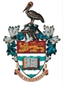
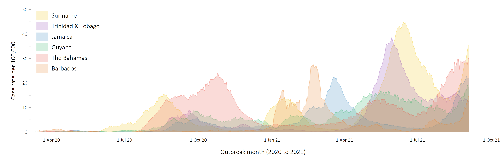

  
  
<h2>COVID-19 Public Health Group</h2>
  <head2>The University of the West Indies</head2>
  <head3> Cave Hill Campus &#8226; Barbados</head3>

 

#### COVID-19 outbreak surveillance for the Caribbean

Since the start of the COVID-19 pandemic, our small group of researchers from the University of the West Indies have been reporting on outbreaks across the region as they occur. We produce daily surveillance updates, and you can download these updates from the Tables below. We have produced peer-reviewed outputs on COVID-19 in the Caribbean, and you can read these articles [here](#article).

{}
This page is now updated **each Monday**. For surveillance updates at any other time, <a href="mailto:ian.hambleton@cavehill.uwi.edu">send me an email</a>.
{}

### Current surveillance downloads
Download our current surveillance outputs from the Tables below. We provide daily updates on the COVID-19 outbreak across the CARICOM community. The CARICOM has 15 member states and 5 Associate members [^1].   

#### Regional surveillance
Four downloads, providing aggregated surveillance outputs for the CARICOM region.


 

#### Country surveillance
Surveillance downloads for each CARICOM member state, in alphabetical order.


 

#### Peer-reviewed COVID-19 articles from our group {id="article"}
Our COVID-19 peer-reviewed outputs:


  
[^1]: The 15 CARICOM members states are: Antigua and Barbuda, Bahamas, Barbados, Belize, Dominica, Grenada, Guyana, Haiti, Jamaica, Montserrat, St Lucia, St Kitts and Nevis, St Vincent and the Grenadines, Suriname, and Trinidad and Tobago. The 5 associate members are: Anguilla, Bermuda, British Virgin Islands, Cayman Islands, and Turks and Caicos Islands.